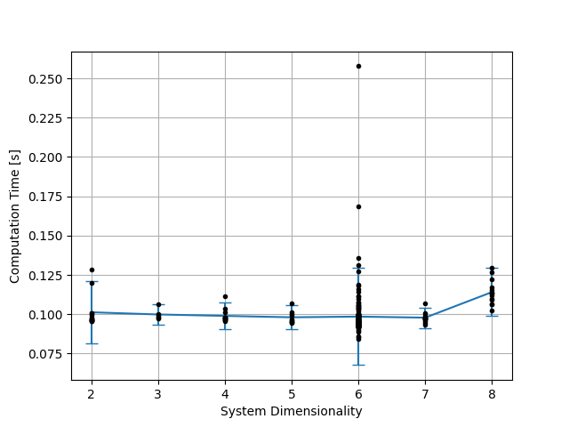
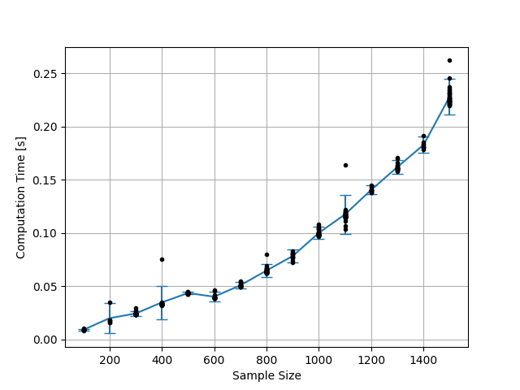
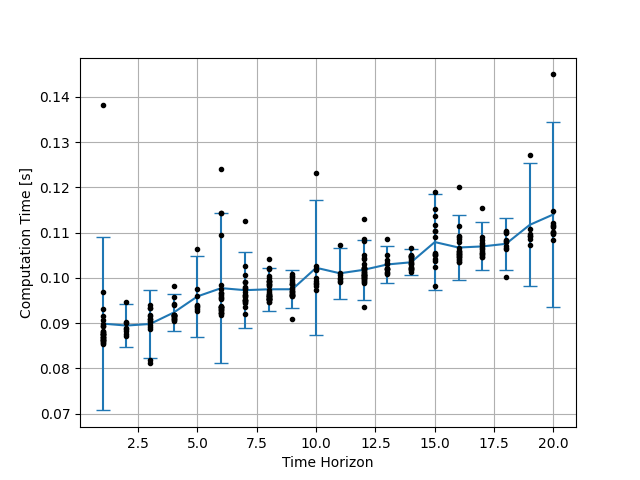

***********************************************
:py:mod:`~gym_socks.algorithms.reach.kernel_sr`
***********************************************

Stochastic reachability algorithm benchmarks.

Parameters
==========

The benchmark parameters have the following default values. When they are not varied as
part of the benchmark, these values are held constant.

.. list-table::
    :widths: auto
    :header-rows: 1

    * - Experiment Parameter
      - Default Value
    * - ``dimensionality``
      - 2
    * - ``sample_size``
      - 1000
    * - ``test_sample_size``
      - 1000
    * - ``time_horizon``
      - 10

Results
=======

In the following figures, the blue line indicates the mean, the black dots indicate the
actual data, and the error bars indicate the 95% confidence interval.

    System dimensionality vs. computation time.

    Sample size vs. computation time.

    Test sample size vs. computation time.

    Time horizon vs. computation time.